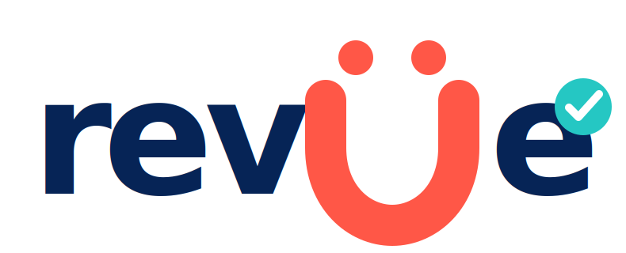

<p align="center">
  
</p>

# revüe Proof Workflow Skill

[](https://github.com/gcorrist66/revue-proof-workflow-skill/actions/workflows/evals.yml)

revüe is a proof-first review-board skill for turning messy work into clear handoffs with evidence,
assumptions, risks, decisions, and a `ship` / `ship with changes` / `caution` / `block` verdict — then
converging on `ship` instead of looping on `caution`.

Use it when an agent needs to review work before it goes to a client, developer, stakeholder, or public
audience.

## What it is good for

- Design and Figma handoffs
- Client-ready review packets
- Website or app implementation QA
- Product/workflow shaping
- Approval-gated actions such as send, publish, deploy, or share
- Funnel checks where visual polish is not enough and proof matters

## What makes it different

- **Review board** — several reviewer lanes (critique, aggressive, conservative, proof, stakeholder)
  over shared inputs and non-negotiables, then one synthesized verdict.
- **Self-enforcing rigor** — an evidence floor, a freshness guard, and validators the agent runs on its
  own draft, so quality doesn't depend on the operator being good.
- **Converge, don't loop** — every non-`ship` verdict carries an owner-tagged path to ship; unchanged
  work is not re-reviewed. It closes work instead of re-grading it.

## Example prompts

```text
Run this through revüe before I send it to the client.
Review this Figma handoff and tell me if it is ship, caution, or block.
Get this to ship — fix what you can and only ask me what you can't.
```

## Install in Claude / Claude Code

```bash
mkdir -p ~/.claude/skills
cp -R revue-proof-workflow ~/.claude/skills/revue-proof-workflow
```

Or use the self-contained installer, which recreates the full tree and refuses to finish unless the
complete eval suite passes inside it:

```bash
python3 scripts/make-installer.py            # writes dist/apply-revue-v1.0.0.sh
bash dist/apply-revue-v1.0.0.sh ~/.claude/skills/revue-proof-workflow
```

Restart Claude / Claude Code if the skill does not appear immediately.

## Install in Codex

```bash
mkdir -p ~/.codex/skills
cp -R revue-proof-workflow ~/.codex/skills/revue-proof-workflow
```

## Validation & evals

The skill ships its own validators and an eval suite that proves its guarantees on every push.

```bash
# check a single handoff or run artifact
python3 scripts/validate-evidence.py path/to/handoff.md --mode design-handoff --strict
python3 scripts/validate-run.py path/to/run.json --strict

# run the full eval suite (golden reviews + every rejection case + regression guards)
python3 scripts/run-evals.py
```

The eval suite (58 cases) asserts that golden reviews across modes validate and reach the expected
verdict, that every failure mode is rejected (dead-end verdict, false ship, thin evidence, missing
source, missing freshness marker, bad path owner), that fixed bugs stay fixed — and, as of v1.0.0,
that the output audit resists active evasion: nine red-team fixtures (`examples/redteam-*.html`) that
try to sneak off-palette colors, obfuscated Hard NOs, and fabricated metrics past the audit are each
proven REJECTED, including a faithful reproduction of the generic-clone-with-fabricated-metric failure
v1.0 exists to prevent. CI runs it via `.github/workflows/evals.yml`.

## Current status

v1.0.0. Opinionated by design. The eval suite is the trust anchor — if it is green, the guarantees
hold. See `docs/v1.0-acceptance-report.md` for the acceptance criteria mapped to their proving evals,
and `examples/dogfood/` for the pipeline run end to end on revüe's own brand.

## Brand

The `revüe` name and logo are brand assets. The MIT license covers the skill source code and packaged
workflow files, but not the right to present a separate product or service as the official revüe
project. See [docs/brand.md](docs/brand.md).

## License

MIT. See [LICENSE](LICENSE).
